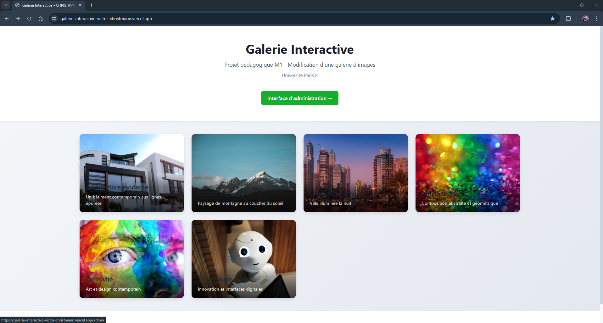
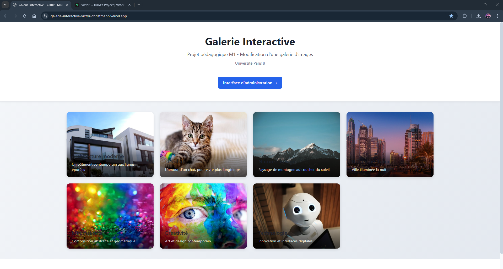
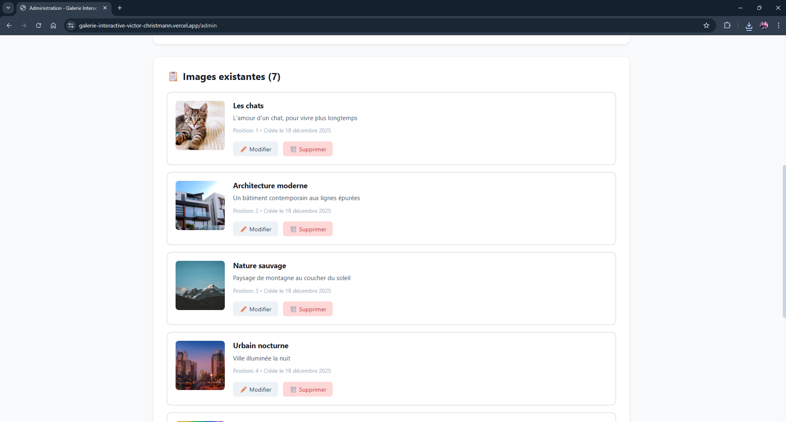
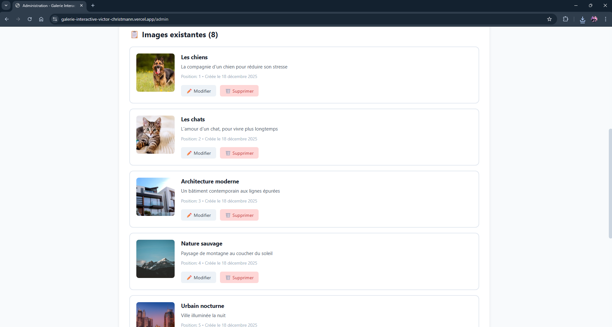

# 🎨 Galerie Interactive – Projet pédagogique M1

## Premier pas (ce que j'ai réussi)

- Récupération des fichiers et sauvegarde des fichiers sur Github
- Importation du dossier Github sur Vercel sans soucis
- Après avoir changer l'URL, mon site est déployé sur : galerie-interactive-victor-christmann.vercel.app

## Premier pas (ce avec quoi j'ai galéré)

- Import sur la base de données de la Table : images

> Solution trouvée via le SQL Editor (importation de la table)


## Site fonctionnel test de plusieurs modifications (Titre / CSS)

- Dans un premier temps je modifie mon 'index.vue'

> Je change le titre et le CSS du bouton 'Interface d'administration' afin d'effectuer un premier changement mineur

- Ensuite je créé un nouveau commit pour envoyer mes modifitions sur Github

> git add . / git commit -m "Amélioration du design & changement du titre" / git push

- Je regarde dans mon Github que les fichiers sont bien remplacés puis que mon Build s'effectue bien sur Vercel



## Ajout d'une image (Test Supabase)

- Je me rend dans l'interface d'administration puis entre de nouvelles données (sur les chats)

> Lors du clique sur : Ajouter l'image, celle ci s'ajoute bien à ma liste sur le site et dans ma base Supabase

- Remarque : La position de l'image peut être la même pour 2 images ce qui influ sur l'ajout d'une image



## Gérer le positionnement des images d'une meilleure façon (pas de doublon de positionnement) lors de la création d'un élément

- Dans un premier temps le but est de penser lors de l'ajout à décaler chaque positionnement d'image

> Pour cela lors de l'ajout d'une image, si une image se trouver à la même position il faudra décaler celle-ci !

```javascript
// 2. Vérification des positions existantes (valeur unique pour chaque image)
const positionExists = images.value.some(
  (img) => img.position === newImage.value.position
);
// 3. Réajuster les positions (si nécéssaire => si la position choisie existe déjà)
if (positionExists) {
  newImage.value.position;
  images.value.forEach(async (img) => {
    if (img.position >= newImage.value.position) {
      await updateImage(img.id, { position: img.position + 1 });
    }
  });
}
```

- Ainsi j'obtiens bien le réajustement des positions dans le cas où il y aurait un conflit



> Je créé un nouvel élément avec la photo d'un chien et la position à '1'



## Gérer le positionnement des images d'une meilleure façon lorsque l'on veut modifier les positions
